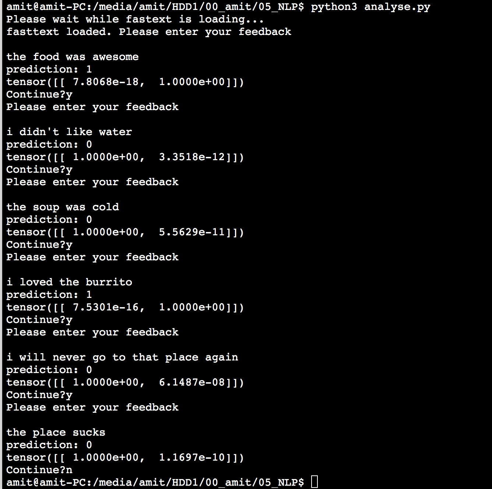

# SentimentAnalysis
Determine the sentiment from the reviews

<b>Prerequisites:</b>
1. Download fasttext pretrained vec file from https://fasttext.cc/docs/en/pretrained-vectors.html
2. install pytorch, gensim, csv, numpy, and spell 

<b>Folder Structure</b>

Data:
Contains the dataset used to train the ML algorithm. 
It also contains a folder "fasttext". Unzip the downloaded fasttext file here

Trained_model:
Contains a pretrained model that is used by the CLI

Images:
Image depicting the usage of CLI

analyse.py: Run this script for CLI to sentiment analysis. It takes some time when started, to load vectors from fasttext.
model.py: the LSTM model used 
utils.py: utility function to preprocess the review text
Untitled.ipynb: interactive jupyter notebook to train the model

<b>To Run</b>

